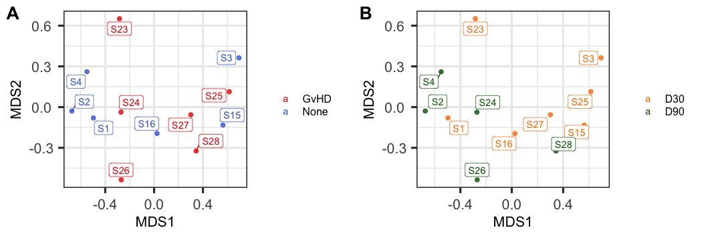

immunoCluster
================
James Opzoomer, Kevin Blighe, Jessica Timms
2021-05-05

-   [1. Introduction to immunoCluster](#1-introduction-to-immunocluster)
-   [2. Main functionalities of
    immunoCluster](#2-main-functionalities-of-immunocluster)
-   [Installation](#installation)
    -   [1. Install the package from
        github](#1-install-the-package-from-github)
    -   [2. Load required packages](#2-load-required-packages)
-   [Walkthrough: Immune profiling PBMC from a two condition
    experimental
    design](#walkthrough-immune-profiling-pbmc-from-a-two-condition-experimental-design)
    -   [1. Introduction](#1-introduction)
    -   [2. Download and import data](#2-download-and-import-data)
    -   [2. Data Exploration](#2-data-exploration)
    -   [3. Dimensionality reduction and
        clustering](#3-dimensionality-reduction-and-clustering)
    -   [4. Biological annotation of the
        clustering](#4-biological-annotation-of-the-clustering)
    -   [5. Statistical testing for cluster differences in abundance and
        marker
        expression](#5-statistical-testing-for-cluster-differences-in-abundance-and-marker-expression)
-   [Subsetting the SCE object](#subsetting-the-sce-object)
-   [Session info](#session-info)
-   [Contact](#contact)
-   [References](#references)

## 1. Introduction to immunoCluster

The immunoCluster package uses the [scDataViz bioconductor
package’s](https://bioconductor.org/packages/devel/bioc/vignettes/scDataviz/inst/doc/scDataviz.html)
vizualization tools and adaptation of the
[SingleCellExperiment](https://www.bioconductor.org/packages/release/bioc/vignettes/SingleCellExperiment/inst/doc/intro.html)
data structure to generate simple and flexible cytometry analysis
workflows, building on the framework originally outlined in Nowicka et
al. [CyTOF workflow: differential discovery in high-throughput
high-dimensional cytometry
datasets](https://f1000research.com/articles/6-748), which is also
extended to build cytometry analysis pipelines in the
[CATALYST](https://www.bioconductor.org/packages/release/bioc/html/CATALYST.html)
bioconductor package.

The immunoCluster package provides a broad toolkit to carry out immune
profiling from both liquid and imaging high-dimensional mass (CyTOF) and
flow cytometry data. immunoCluster features standardized data
infrastructure, making use of the SingleCellExperiment class object,
scDataViz interactive visualization tools along with convenient
implementations for popular dimensionality reduction and clustering
algorithms designed for a non-specialist. To learn using immunoCluster
we have provided a walkthrough below exploring some of the package’s
basic functionality on a published dataset.

An in depth report of immunoCluster’s use to create liquid and imaging
mass cytometry analysis pipelines, as well as its use for fluorescent
flow cytometry analysis is outlined in our recent paper in [eLife
here](https://elifesciences.org/articles/62915).

## 2. Main functionalities of immunoCluster

The basic pipeline of immunoCluster analysis involves:

-   Creating file and marker labels to generate the experimental design

-   Importing .fcs data into the SingleCellExperiment object

-   Exploratory analysis of the data

-   Dimensionality reduction

-   Clustering and biological interpretation of the clusters

-   Statistical testing for differences in cluster abundance and marker
    expression

# Installation

## 1. Install the package from github

Install the development version of the package, installation will
usually take a few minutes, depending on the number of dependencies that
have been installed on your computer. Install immunoCluster from github
here:

``` r
  # Install devtools for github installation if not present
  require(devtools)
  
  # Install the ImmunoCluster package
  devtools::install_github("kordastilab/ImmunoCluster")
  
  # May need to run this line if an R build version error while installing appears
  # Sys.setenv(R_REMOTES_NO_ERRORS_FROM_WARNINGS="true")
```

## 2. Load required packages

Load necessary packages:

``` r
  library(immunoCluster)
  library(stringr)
  library(cowplot)
  library(RColorBrewer)
```

# Walkthrough: Immune profiling PBMC from a two condition experimental design

## 1. Introduction

In this walkthrough we will learn to perform immune profiling with
immunoCluster to examine changes in immune populations from human PBMC
following bone marrow transplantation (BMT).

We will start with pre-gated .fcs data files. The samples were taken
from patients following hematopoetic reconstitution in leukemia patients
following BMT. The dataset represents 15 individuals, sampled at two
time points (Day 30 and 90) after BMT, for a total of 28 samples. Of
these patients, a small subset suffered from graft versus host disease
(GvHD, n = 3), whereas most other patients did not experience such
complications.

We have performed gating cleanup on a subset of the dataset which can be
dowloaded from zenodo, along with all the other data required for the
walkthough.

The data was originally reported in [Comprehensive Immune Monitoring of
Clinical Trials to Advance Human
Immunotherapy](https://www.sciencedirect.com/science/article/pii/S2211124719308228).
The full raw data (not used here, but which was used in the
immunoCluster paper) is available
[here](http://flowrepository.org/id/FR-FCM-Z244) and the full
preprocessed data is available from the zenodo link.

All the data required can be downloaded from Zenodo.
[](https://doi.org/10.5281/zenodo.3801882)

## 2. Download and import data

You can download all the .fcs files from zenodo
[here](https://doi.org/10.5281/zenodo.3801882), or alternatively you can
download the SingleCellExperiment object directly into memory and skip
the import process just below. The fcs files can be downloaded from this
[download\_link](https://zenodo.org/record/3801882/files/fcs_data.zip?download=1).

The experimental design informs the metadata we will need to incorporate
into the SingleCellExperiment (SCE) object, here we have created one
table (from an excel file), that contains five columns, and one row for
each .fcs file. We will include the .fcs filename, the GvHD “condition”
of the patient, patient\_id, a unique sample\_id, and the day\_id
representing the day following BMT that the sample was taken.
[Download\_link](https://zenodo.org/record/3801882/files/sample_metadata.xlsx?download=1)

``` r
# Download sample metadata from Zenodo
sample_metadata_df = readRDS(url("https://zenodo.org/record/3801882/files/sample_metadata.rds"))

head(sample_metadata_df)
```

    ## # A tibble: 6 x 5
    ##   file_name           condition patient_id sample_id day_id
    ##   <chr>               <fct>     <chr>      <chr>     <fct> 
    ## 1 BMT01_D30_clean.fcs None      P1         S1        D30   
    ## 2 BMT01_D90_clean.fcs None      P1         S2        D90   
    ## 3 BMT02_D30_clean.fcs None      P2         S3        D30   
    ## 4 BMT02_D90_clean.fcs None      P2         S4        D90   
    ## 5 BMT08_D30_clean.fcs None      P8         S15       D30   
    ## 6 BMT09_D30_clean.fcs None      P9         S16       D30

We also create a table that represents the marker panel information.
This table contains a row for every channel in the original fcs file.
The columns represent the original name of the channel and the channel
name we want to rename it to in the antigen column. We then optionally
include columns of binary 1 and 0s that allow us to group markers into
relevant sets, here we have two sets, one group of markers for
clustering and another for downstream expression analysis on our cell
populations of interest. Any marker that is not included in either group
will be discarded when we build the SCE object. This table must be an
exact match to the order that the markers are represented in the raw
.fcs files or the channel renaming will be incorrect or fail.
[Download\_link](https://zenodo.org/record/3801882/files/panel_metadata.xlsx?download=1).

``` r
# Download panel metadata from Zenodo
panel_metadata_df = readRDS(url("https://zenodo.org/record/3801882/files/panel_metadata.rds"))

head(panel_metadata_df)
```

    ## # A tibble: 6 x 4
    ##   metal     antigen  clustering activation
    ##   <chr>     <chr>         <dbl>      <dbl>
    ## 1 BCKG190Di blank_00          0          0
    ## 2 Ba138Di   blank_01          0          0
    ## 3 Bi209Di   CD16              1          0
    ## 4 Ce140Di   beads             0          0
    ## 5 Ce142Di   beads_1           0          0
    ## 6 Center    blank_8           0          0

``` r
# Create marker grouping designations
clustering_markers = panel_metadata_df$antigen[panel_metadata_df$clustering ==1]
activation_markers = panel_metadata_df$antigen[panel_metadata_df$activation == 1]
col_names = panel_metadata_df$antigen[panel_metadata_df$clustering == 1 | panel_metadata_df$activation == 1 ]

# Select columns to dicard from fcs file
discard = setdiff(panel_metadata_df$antigen, c(clustering_markers, activation_markers))
queries = str_detect(panel_metadata_df$antigen, paste(discard, collapse = "|"))

if(length(discard) > 0){colsDiscard = panel_metadata_df$metal[queries]
}else{colsDiscard = ''}
```

We next load the .fcs data and the metadata into the SCE object. Here
the number of rows in the metadata must match the number of .fcs files
to be analyzed. We have the option to specify the scaling transformation
and the cofactor. Here we have used asinh with cofactor 5, which is the
default value. It is possible to downsaple from each file or by a
specified metadata grouping, although here we have not downsampled in
this case. The columns are also renamed as specified in the
panel\_metadata table and columns not needed are discarded.

``` r
# Collect all .fcs files from a directory
filelist = list.files(
      path = "fcs_data/",
    pattern = "*.fcs|*.FCS",
    full.names = TRUE)

# Select which metadata to include from the sample metadata table
metadata = data.frame(
      file = filelist, 
      group = sample_metadata_df$sample_id,
      condition = sample_metadata_df$condition,
      patient_id = sample_metadata_df$patient_id,
      day_id = sample_metadata_df$day_id,
      row.names = filelist,
      stringsAsFactors = FALSE)

# Create SCE object with CyTOF data inside
require(SingleCellExperiment)
  sce_gvhd = processFCS(
    files = filelist,
    metadata = metadata,
    filter = FALSE, # Do not perform noise filtering
    transformation = TRUE, # Transform data
    transFun = function (x) asinh(x), # Using asinh function (cofactor 5 is used by default)
    downsampleVar = NULL, # No downsampling by variance
    downsample = NULL, # Downsample to n cells per downsample_grouping 
    downsample_grouping = NULL, # if downsample = n, downsample n cells by the specified metadata grouping.
    newColnames = col_names, # Rename columns from panel metadata 
    colsDiscard = colsDiscard) # Discard columns not selected for downstream analysis

sce_gvhd
```

Using the code chunk below you can download the processed r data object
with the metatdata incorporated, directly into memory to skip the import
steps to save time:

``` r
# Download complete immunoCluster SCE object from zenodo 
# Some versions of R can timeout the download at 60 seconds
# If the download is taking longer run the below line to extend the download timeout window to 400 seconds 
options(timeout = 400)
sce_gvhd = readRDS(url("https://zenodo.org/record/3801882/files/sce_gvhd.rds"))

sce_gvhd
```

    ## class: SingleCellExperiment 
    ## dim: 32 912813 
    ## metadata(5): file group condition patient_id day_id
    ## assays(1): scaled
    ## rownames(32): CD16 CD152 ... HLA_DR CD56
    ## rowData names(0):
    ## colnames(912813): cell1 cell2 ... cell912812 cell912813
    ## colData names(0):
    ## reducedDimNames(0):
    ## altExpNames(0):

## 2. Data Exploration

We provide several functions to examine global patterns within the data,
they can be used to get an idea of the influence of conditions/treatment
or batch effects within the data. The mdsplot() function will generate a
multi-dimensional scaling (MDS) plot on median expression values for
each channel using the
[limma](https://bioconductor.org/packages/release/bioc/html/limma.html)
bioconductor package. MDS plots represent an unsupervised way to
indicate similarities between samples at a global level before more in
depth analysis. In the example here we can see that there is no
observable high-level difference between the two GvHD condition samples,
however there does appear to be a weak separation between samples
collected at D30 and D90 post BMT. Here and throughout the pipeline,
colkey can be used to specify plotting colors for graphing conditions.

``` r
mds1 = mdsplot(sce_gvhd, 
               feature = "condition", 
               colkey = c(None = 'royalblue', GvHD = 'red2'))

mds2 = mdsplot(sce_gvhd, 
               feature = "day_id", 
               colkey = c(D30  = 'darkorange1', D90 = 'darkgreen'))

plot_grid(mds1, mds2,
    labels = c('A','B'),
    ncol = 2, align = "l", label_size = 20)
```



Further to the mds plots,the medianHeatmap() function will generate a
heatmap with median marker expression across all (default) or a
selection (with markers = ). The heatmap is clustered over rows and
columns. The heatmap can be generated on the asinh transformed values
(default) or 0-min to 1-max scaled (with scale\_01 = T). The heatmap
should provide insight as to which markers are highly expressed and
whether their marker expression profile is associated with a metadata
condition. Highly expressed markers will have a greater influence on
clustering and this will help understand clustering results generated
downstream.

``` r
feature = medianHeatmap(sce_gvhd, grouping = "group", feature = "condition", feature_cols = c('royalblue', 'red2'))
```


## 3. Dimensionality reduction and clustering

immunoCluster supports multiple different dimensionality reduction
algorithms and has UMAP and tSNE functionality implemented below with
the ability to downsample before running the algorithms. We run both
UMAP and tSNE on selected lineage markers, downsampling to 1000 cells
per sample id ‘group’ metadata slot (selected by specifying a
downsample\_grouping metadata slot) to reduce runtime. The
dimensionality reductions are stored in the reducedDimNames slot and any
other dimensionality reduction, like PCA, can also be stored in the SCE
object in parallel.

``` r
require(umap)
# Run UMAP and store in sce object
sce_gvhd = performUMAP(sce_gvhd, 
                       downsample = 1000, # Downsample to 1000 cells per downsample_grouping condition
                       downsample_grouping = "group", # Downsample by sample id 'group' metadata slot
                       useMarkers = clustering_markers) # Run UMAP only on selected markers

# Run tSNE and store in sce object
sce_gvhd = performTSNE(sce_gvhd, 
                       downsample = 1000, # Downsample to 1000 cells per downsample_grouping condition
                       downsample_grouping = "group",  # Downsample by sample id 'group' metadata slot
                       useMarkers = clustering_markers) # Run UMAP only on selected markers

sce_gvhd
```

    ## class: SingleCellExperiment 
    ## dim: 32 912813 
    ## metadata(5): file group condition patient_id day_id
    ## assays(1): scaled
    ## rownames(32): CD16 CD152 ... HLA_DR CD56
    ## rowData names(0):
    ## colnames(912813): cell1 cell2 ... cell912812 cell912813
    ## colData names(0):
    ## reducedDimNames(2): UMAP Rtsne
    ## altExpNames(0):

The markerExpression() function will allow us to view the UMAP
dimensionality reductions, overlaying marker expression of our major
immune subpopulation lineage markers as an exploratory analysis of the
previously generated UMAP. The dimensionality reduction slot to use is
specified with the reducedDim parameter. The markers and several ggplot
style plotting parameters can be specified resulting in tiled plots of
the UMAP with marker expression as colour.

``` r
expression_markers =  c('CD3', 'CD4', 'CD8a', 'CD11b', 'CD19', 'CD56')

exp_plot_umap = markerExpression(sce_gvhd,
    markers = expression_markers,
    reducedDim = 'UMAP',
    title = 'UMAP',
    nrow = 1, ncol = 6,
    pointSize = 0.05,
    legendKeyHeight = 1.0,
    legendLabSize = 14,
    stripLabSize = 20,
    axisLabSize = 18,
    titleLabSize = 20,
    captionLabSize = 22)

exp_plot_tsne = markerExpression(sce_gvhd,
    markers = expression_markers,
    reducedDim = 'Rtsne',
    title = 'tSNE',
    nrow = 1, ncol = 6,
    pointSize = 0.05,
    legendKeyHeight = 1.0,
    legendLabSize = 14,
    stripLabSize = 20,
    axisLabSize = 18,
    titleLabSize = 20,
    captionLabSize = 22)

plot_grid(exp_plot_umap, exp_plot_tsne,
    labels = c('A','B'),
    nrow = 2, align = "l", label_size = 24)
```


immunoCluster provides several wrapper functions to perform unsupervised
clustering on your data. Currently users can implement either
Rphenograph or FlowSOM with consensus clustering. Here we have used an
ensemble method of FlowSOM and ConsensusClusterPlus, which allows us to
perform a scalable clustering on our dataset. We perform the clustering
on all cells using a selection of lineage markers, with a final desired
cluster number of up to 10, specified by the parameter k. FlowSOM will
cluster cells into 100 SOM codes defined by the (dimensions of som\_x
and som\_y) and these will be clustered into 2-k clusters and all of
these clustering results are saved as metadata in the SCE object.

``` r
# Install Rphenograph from github
# devtools::install_github("JinmiaoChenLab/Rphenograph")

# Run phenograph clustering
sce_gvhd = runPhenograph(sce_gvhd, k = 10, markers = clustering_markers)
```

``` r
# Run FlowSOM and Consusus cluster plus method
sce_gvhd = runFlowSOM(sce_gvhd, k = 10, markers = clustering_markers, som_x = 10, som_y = 10)
```

    ## Building SOM

    ## Mapping data to SOM

The clustering identities are stored in the metadata dataframe. The per
cell membership of the 100 SOM codes is stored under som\_codes and the
respective clusterings are stored under flowsom\_cc\_k(k=n). We can
vizualise the clustering or any other metatdata on the dimensionality
plot using the function metadataPlot() (which maps to UMAP by default
but can specify other dimension reductions that are stored in the SCE,
like tSNE). We can also vizualise the abundance of each cluster as a
proportion of total cells per sample using the plotAbundance() function.

``` r
# Plot UMAP with flowsom k=10 clustering overlay
fsom_k10 = metadataPlot(sce_gvhd,
    colby = 'flowsom_cc_k10',
    title = '',
    reducedDim = 'UMAP',
    legendPosition = 'right',
    legendLabSize = 8,
    axisLabSize = 10,
    titleLabSize = 10,
    subtitleLabSize = 1,
    captionLabSize = 16)

# Specify all clusters to plot abundance for
fsom_clusters = unique(sce_gvhd@metadata$flowsom_cc_k10)

# Create boxplot of flowsom k=10 abundance 
fsom_abundance = plotAbundance(sce_gvhd,
              clusters = fsom_clusters,
              clusterAssign = 'flowsom_cc_k10',
              feature = NULL,
              legendPosition = 'none', 
              stripLabSize = 10,
              axisLabSize = 14,
              titleLabSize = 12,
              subtitleLabSize = 10,
              captionLabSize = 18)


plot_grid(fsom_k10, fsom_abundance,
    labels = c('A','B'),
    ncol = 2, align = "l", label_size = 20, rel_widths = c(1.4, 1))
```


## 4. Biological annotation of the clustering

The medianHeatmap() function can also be used to display the median
marker expression values of each flowSOM metacluster, by specifying the
metadata clustering in the grouping parameter. Here the median values
are 0-1 scaled to emphasize the differences between clusters (using
scale\_01 = T).

``` r
# With feature
feature = medianHeatmap(sce_gvhd, grouping = "flowsom_cc_k10", feature = NULL, scale_01 = T)
```


The heatmap can be used to interperet the biological identity of the
clusters generated by flowSOM and consesusClusterPlus. Another way to
understand which markers are enriched per cluster is by using the
findMarkers() function from the [scran
bioconductor](https://bioconductor.org/packages/release/bioc/html/scran.html)
package. Here we perform a wilcox test to understand which markers have
a LogFC &gt; 1.5 enrichment between one cluster and several others.

``` r
library(scran)
library(tibble)

# Generate list of upregulated markers
cytof_markers = findMarkers(assay(sce_gvhd), sce_gvhd@metadata$flowsom_cc_k10, test.type="wilcox", direction="up",lfc=1.5, pval.type="some")

cluster_markers = NULL
top_n = 3 # The number of top upregulated markers to display
for (i in 1:length(cytof_markers)) {
  
  deg_markers = cytof_markers[[i]][1:top_n,1:2]
  
  deg_markers = rownames_to_column(as.data.frame(deg_markers), var = "marker")
  
  markers = data.frame(cluster = rep(i, top_n), deg_markers)
  
  cluster_markers = rbind(cluster_markers, markers)
  
}

# Show top 3 DEG markers per cluster
head(cluster_markers)
```

    ##   cluster marker p.value FDR
    ## 1       1   CD14       0   0
    ## 2       1   CD33       0   0
    ## 3       1  CD11b       0   0
    ## 4       2  CD11c       0   0
    ## 5       2   CD16       0   0
    ## 6       2  CD123       0   0

From this information we can assign identities to the clusters using the
setClusterIdents() function. We input a vector of original clusters,
along with the new clusters we wish to assign these original cluster
assignments to. The new cluster assignments will be stored in the
metadata as cell\_annotation. We can then assign this cell\_annotation
to a new metadata slot to store and reassign using setClusterIdents()
again.

``` r
# Assignments
original_cluster_ident = as.character(rep(1:10))
new_cluster_ident = c("Monocytes", "cDC", "NKT Cells", "CD4+ T Cells", "B Cells","gd T Cells", "CD8+ T Cells", "Basophils", "CD4+ Treg", "NK")

# Set the new annotations
sce_gvhd = setClusterIdents(sce_gvhd, orig.ident = original_cluster_ident , new.ident = new_cluster_ident, clustering = 'flowsom_cc_k10')

# Define population colours
cols = brewer.pal(10, "Set3")

# Assign to populations for plotting
col_key = c("Monocytes" = cols[1], "cDC" = cols[2], "NKT Cells" = cols[3], "CD4+ T Cells" = cols[4], "B Cells" = cols[5], "gd T Cells" = cols[6], "CD8+ T Cells" = cols[7], "Basophils" = cols[8], "CD4+ Treg" = cols[9], "NK" = cols[10])

# Vizualise in UMAP space
cell_annotation = metadataPlot(sce_gvhd,
    colby = 'cell_annotation',
    colkey = col_key, # Add colours for plotting 
    title = '',
    legendLabSize = 8,
    axisLabSize = 20,
    titleLabSize = 20,
    subtitleLabSize = 16,
    captionLabSize = 16)

annotated_clusters = unique(sce_gvhd@metadata$flowsom_cc_k10)

annotated_abundance = plotAbundance(sce_gvhd,
              clusters = annotated_clusters,
              clusterAssign = 'cell_annotation',
              feature = NULL,
              colkey = col_key,
              legendPosition = 'none', 
              stripLabSize = 10,
              axisLabSize = 14,
              titleLabSize = 12,
              subtitleLabSize = 10,
              captionLabSize = 18)

plot_grid(cell_annotation, annotated_abundance, 
    labels = c('A','B'), align = "l", label_size = 20, rel_widths = c(1.5,1), rel_heights = c(1.3,1))
```


The plotAbundance() function can be used to create bar plots by
specifying graph\_type = “bar.” Specifying a metadata feature will split
the data by this feature will create another level of comparison, first
by plotting abundance by sample as a stacked bar and then arranging the
samples by GvHD condition.

``` r
bar_plot = plotAbundance(sce_gvhd,
              graph_type = 'bar',
              clusters = annotated_clusters,
              clusterAssign = 'cell_annotation',
              feature = 'condition',
              colkey = col_key,
              legendLabSize = 7,
              stripLabSize = 22,
              axisLabSize = 22,
              titleLabSize = 22,
              subtitleLabSize = 18,
              captionLabSize = 18)

bar_plot
```


Once we have defined the biological identity of our clusters we can
create a heatmap to check that the marker expression patterns are
consistent with our labels. Here we use medianHeatmap to create 0-1
normalised heatmap per cluster. We can also modify the the heat bar from
the default greens to a black-white gradient (using heat\_bar =
“greys”).

``` r
# With feature
feature = medianHeatmap(sce_gvhd, 
                        grouping = "cell_annotation",
                        markers = clustering_markers,
                        feature = NULL, 
                        scale_01 = T, 
                        heat_bar = "Greys")
```


## 5. Statistical testing for cluster differences in abundance and marker expression

We can now visualize the data by GvHD status to better understand the
differences that may help us define biomarkers to predict GvHD status
post BMT. We can also use the metadataPlot() function to split the UMAP
by GvHD status by defining colkey and splitting the UMAP plot by
condition with facet\_wrap(\~condition). Also by adding a feature
parameter to the plotAbundance function we can split the boxplot by GvHD
status allowing us to investigate changes in cell subset abundance by
disease status or another metadata feature slot.

``` r
cell_annotation_dif = metadataPlot(sce_gvhd,
    colby = 'condition',
    title = '',
    colkey = c(None = 'royalblue', GvHD = 'red2'),
    legendPosition = 'right',
    pointSize = 0.3,
    legendLabSize = 8,
    axisLabSize = 14,
    titleLabSize = 16,
    subtitleLabSize = 16,
    captionLabSize = 16)

cell_annotation_dif = cell_annotation_dif + facet_wrap(~condition)

abundance_dif = plotAbundance(sce_gvhd,
              clusters = annotated_clusters,
              clusterAssign = 'cell_annotation',
              feature = 'condition',
              colkey = c(None = 'royalblue', GvHD = 'red2'),
              legendPosition = 'none', 
              stripLabSize = 10,
              axisLabSize = 14,
              titleLabSize = 12,
              subtitleLabSize = 10,
              captionLabSize = 18)

plot_grid(cell_annotation_dif, abundance_dif,
    labels = c('A','B'),
    ncol = 2, align = "l", label_size = 20, rel_widths = c(1.6,1))
```


Finally we can perform a wilcoxon rank sum test to see if we can detect
statistically significant changes in cluster abundance between our two
experimental conditions. stat\_test\_clust\_results() will perform a
wilcox test on our the proportions of cell type abundance per sample
between conditions and produce a results table along with Log fold
change and the proportion of each sample that each cluster represents.
We can then use volcanoPlot() to generate a volcano plot, which shows us
that there is a significant difference between the abundance of B cells
between our two conditions. We can see that in our dataset it appears
that B Cells are markedly reduced in those patients that go on to
develop GvHD. In addition to the wilcox test implemented here there are
other useful packages that implement robust statistical methods for
differential abundance and differential expression analysis, such as the
bioconductor packages
[diffCyt](https://www.bioconductor.org/packages/release/bioc/html/diffcyt.html)
and
[cydar](https://bioconductor.org/packages/release/bioc/html/cydar.html).

``` r
# Wilcox test on cluster proportion abundance
stat_test_clust_results = stat_test_clust(sce_gvhd,
                        group = 'group', # group the files by sample ID metadata slot 'group'
                        clustering = 'cell_annotation', # The clustering label to use
                        feature = 'condition')

head(stat_test_clust_results[,c(1,14:18)])
```

    ##        cluster proportion proportion.1       logfc       pval      padj
    ## 1      B Cells  0.7571028    6.4246483 -2.13839808 0.01040562 0.1040562
    ## 2    Basophils  0.4749399    0.5833272 -0.20556014 0.52183939 0.8697323
    ## 3 CD4+ T Cells  8.4219643   12.6510706 -0.40689875 0.26233168 0.8697323
    ## 4    CD4+ Treg  1.1673934    0.7770172  0.40706623 0.87278012 0.8727801
    ## 5 CD8+ T Cells 18.5345116   18.8898577 -0.01899066 0.87278012 0.8727801
    ## 6          cDC  0.8772951    2.0589283 -0.85309741 0.07816909 0.3908454

``` r
gg_volcano = volcanoPlot(stat_test_clust_results, p_val = "padj", threshold = 0.12)

abundance_bcell = plotAbundance(sce_gvhd,
              clusters = c("B Cells", "Basophils"),
              clusterAssign = 'cell_annotation',
              feature = 'condition',
              colkey = c(None = 'royalblue', GvHD = 'red2'),
              legendPosition = 'right', 
              stripLabSize = 10,
              axisLabSize = 14,
              titleLabSize = 12,
              subtitleLabSize = 10,
              captionLabSize = 18)

plot_grid(gg_volcano, abundance_bcell,
    labels = c('A','B'),
    ncol = 2, align = "l", label_size = 20, rel_widths = c(1,1.4))
```


We can perform the same process of applying a wilcoxon test for
expression levels of markers, across all markers on all populations by
using the stat\_test\_expression() function. We can plot the results a
volcano plot as before using volcanoPlot(). Aditoionally it is possible
to vizualise cluster specific expression of certain makers with
markerExpressionPerSample() to look at the median marker expression per
sample on selected clusters (or all clusters).

``` r
# Wilcox test on marker expression
marker_test = stat_test_expression(sce_gvhd,
                assay = 'scaled', # The sce assay slot
                grouping = 'group', # group the files by sample ID metadata slot 'group'
                feature = 'condition', # The contrast metatdata
                clusterAssign = 'cell_annotation') # The clustering label to use

sig_markers = marker_test[which(marker_test$p_val < 0.05),]

head(sig_markers)
```

    ##                 cluster        S1         S2         S3         S4       S15
    ## 43            cDC_PDL_1 0.0000000 0.03833666 0.03454712 0.02409312 0.0000000
    ## 74     NKT Cells_CD45RA 2.9245811 2.82914412 1.35815724 1.62859842 1.3404085
    ## 88        NKT Cells_CD3 4.6261090 4.66563326 4.56496722 4.57661471 4.5837929
    ## 106 CD4+ T Cells_CD45RA 1.6022981 0.87746351 0.39035619 0.46861896 0.1388336
    ## 112   CD4+ T Cells_PD_1 0.1060011 0.30094336 0.17684411 0.35370009 0.7500233
    ## 133        B Cells_CCR7 1.4479768 1.90229903 1.99799022 2.32094205 1.0633981
    ##           S16        S23        S24       S25        S26       S27        S28
    ## 43  0.0000000 0.07893154 0.02029057 0.2797268 0.76921816 0.4672593 0.10298348
    ## 74  1.8112743 1.34732314 1.48795015 0.5681961         NA 0.8301662 0.74637372
    ## 88  4.8404246 4.57702149 4.48036593 4.2798380         NA 4.4999407 3.86990581
    ## 106 0.2393415 0.17488804 0.21700140 0.1083829 0.05085623 0.3204029 0.06000536
    ## 112 0.2040139 3.22044827 2.55991190 1.7497636 0.29420018 1.4976574 0.52886947
    ## 133 0.5621361 0.83526030 1.41891478 1.0311894 0.04672376 0.2211306 0.00000000
    ##        mean_1     mean_2       logfc      p_val      padj
    ## 43  0.2864016 0.01616282  2.87468184 0.01556764 0.5929411
    ## 74  0.9960019 1.98202728 -0.68812634 0.02845974 0.5929411
    ## 88  4.3414144 4.64292362 -0.06714407 0.01762209 0.5929411
    ## 106 0.1552561 0.61948531 -1.38381275 0.02497468 0.5929411
    ## 112 1.6418085 0.31525431  1.65017398 0.02497468 0.5929411
    ## 133 0.5922031 1.54912372 -0.96159499 0.02497468 0.5929411

``` r
# Create volcano plot
gg_volcano = volcanoPlot(marker_test, p_val = "p_val", threshold = 0.05)

# Difference in activation markers per cluster
pd_expression = markerExpressionPerSample(sce_gvhd,
    caption = '',
    clusters = c("CD8+ T Cells", "cDC"),
    feature = 'condition',
    clusterAssign = 'cell_annotation',
    markers = activation_markers[3:5],
    colkey = c(None = 'royalblue', GvHD = 'red2'),
    title = '',
    stripLabSize = 12,
    axisLabSize = 10,
    titleLabSize = 18,
    subtitleLabSize = 10,
    captionLabSize = 10)


plot_grid(gg_volcano, pd_expression,
    labels = c('A','B'),
    ncol = 2, align = "l", label_size = 20, rel_widths = c(1,1.4))
```


# Subsetting the SCE object

It is possible to subset the sce\_gvhd object for further clustering,
for instance, in a situation when increased cluster resolution is
desired or where you want to display the proportion of a certain cluster
as a percentage of another parent populations, for instance CD4+ Tregs
as a proportion of all CD4+ T cells. Subsetting can be performed using
the subset\_sce\_metadata() function. The function can subset the
sce\_gvhd cells on any specified metadata slot using using conditional
statements and a couple of examples are presented below:

``` r
# Subset by patient_ID
sce_subset = subset_sce_metadata(sce_gvhd, patient_id %in% c("P1", "P9", "P15"))
# Subset by clustering identity
sce_cd4 = subset_sce_metadata(sce_gvhd, cell_annotation %in% c("CD4+ T Cells", "Basophils"))

table(sce_subset@metadata$patient_id)
```

    ## 
    ##     P1    P15     P9 
    ## 156422 131263  98571

``` r
table(sce_cd4@metadata$cell_annotation)
```

    ## 
    ##    Basophils CD4+ T Cells 
    ##         5241       101908

# Session info

``` r
sessionInfo()
```

    ## R version 4.0.4 (2021-02-15)
    ## Platform: x86_64-apple-darwin17.0 (64-bit)
    ## Running under: macOS High Sierra 10.13.6
    ## 
    ## Matrix products: default
    ## BLAS:   /Library/Frameworks/R.framework/Versions/4.0/Resources/lib/libRblas.dylib
    ## LAPACK: /Library/Frameworks/R.framework/Versions/4.0/Resources/lib/libRlapack.dylib
    ## 
    ## locale:
    ## [1] en_US.UTF-8/en_US.UTF-8/en_US.UTF-8/C/en_US.UTF-8/en_US.UTF-8
    ## 
    ## attached base packages:
    ## [1] parallel  stats4    stats     graphics  grDevices utils     datasets 
    ## [8] methods   base     
    ## 
    ## other attached packages:
    ##  [1] tibble_3.1.1                scran_1.18.7               
    ##  [3] umap_0.2.7.0                RColorBrewer_1.1-2         
    ##  [5] cowplot_1.1.1               stringr_1.4.0              
    ##  [7] immunoCluster_0.1.0         dplyr_1.0.5                
    ##  [9] ggrepel_0.9.1               ggplot2_3.3.3              
    ## [11] SingleCellExperiment_1.12.0 SummarizedExperiment_1.20.0
    ## [13] Biobase_2.50.0              GenomicRanges_1.42.0       
    ## [15] GenomeInfoDb_1.26.7         IRanges_2.24.1             
    ## [17] S4Vectors_0.28.1            BiocGenerics_0.36.1        
    ## [19] MatrixGenerics_1.2.1        matrixStats_0.58.0         
    ## [21] kableExtra_1.3.4            knitr_1.31                 
    ## 
    ## loaded via a namespace (and not attached):
    ##   [1] Rtsne_0.15                  colorspace_2.0-0           
    ##   [3] ellipsis_0.3.1              scuttle_1.0.4              
    ##   [5] bluster_1.0.0               cytolib_2.2.1              
    ##   [7] XVector_0.30.0              base64enc_0.1-3            
    ##   [9] BiocNeighbors_1.8.2         rstudioapi_0.13            
    ##  [11] farver_2.1.0                hexbin_1.28.2              
    ##  [13] CytoML_2.2.2                RSpectra_0.16-0            
    ##  [15] fansi_0.4.2                 xml2_1.3.2                 
    ##  [17] sparseMatrixStats_1.2.1     jsonlite_1.7.2             
    ##  [19] broom_0.7.6                 cluster_2.1.1              
    ##  [21] png_0.1-7                   pheatmap_1.0.12            
    ##  [23] graph_1.68.0                compiler_4.0.4             
    ##  [25] httr_1.4.2                  dqrng_0.2.1                
    ##  [27] backports_1.2.1             Matrix_1.3-2               
    ##  [29] limma_3.46.0                cli_2.4.0                  
    ##  [31] BiocSingular_1.6.0          htmltools_0.5.1.1          
    ##  [33] tools_4.0.4                 ncdfFlow_2.36.0            
    ##  [35] rsvd_1.0.5                  igraph_1.2.6               
    ##  [37] gtable_0.3.0                glue_1.4.2                 
    ##  [39] GenomeInfoDbData_1.2.4      flowWorkspace_4.2.0        
    ##  [41] RANN_2.6.1                  reshape2_1.4.4             
    ##  [43] ggcyto_1.18.0               Rcpp_1.0.6                 
    ##  [45] vctrs_0.3.7                 svglite_2.0.0              
    ##  [47] DelayedMatrixStats_1.12.3   xfun_0.22                  
    ##  [49] beachmat_2.6.4              rvest_1.0.0                
    ##  [51] irlba_2.3.3                 lifecycle_1.0.0            
    ##  [53] statmod_1.4.35              XML_3.99-0.6               
    ##  [55] edgeR_3.32.1                zlibbioc_1.36.0            
    ##  [57] scales_1.1.1                RProtoBufLib_2.2.0         
    ##  [59] RBGL_1.66.0                 yaml_2.2.1                 
    ##  [61] curl_4.3                    aws.signature_0.6.0        
    ##  [63] reticulate_1.19             gridExtra_2.3              
    ##  [65] latticeExtra_0.6-29         stringi_1.5.3              
    ##  [67] highr_0.8                   Rphenograph_0.99.1         
    ##  [69] flowCore_2.2.0              BiocParallel_1.24.1        
    ##  [71] rlang_0.4.10                pkgconfig_2.0.3            
    ##  [73] systemfonts_1.0.1           bitops_1.0-6               
    ##  [75] evaluate_0.14               lattice_0.20-41            
    ##  [77] purrr_0.3.4                 labeling_0.4.2             
    ##  [79] tidyselect_1.1.0            plyr_1.8.6                 
    ##  [81] magrittr_2.0.1              R6_2.5.0                   
    ##  [83] generics_0.1.0              DelayedArray_0.16.3        
    ##  [85] DBI_1.1.1                   pillar_1.6.0               
    ##  [87] withr_2.4.2                 RCurl_1.98-1.3             
    ##  [89] FlowSOM_1.22.0              tsne_0.1-3                 
    ##  [91] crayon_1.4.1                utf8_1.2.1                 
    ##  [93] rmarkdown_2.7               aws.s3_0.3.21              
    ##  [95] jpeg_0.1-8.1                locfit_1.5-9.4             
    ##  [97] grid_4.0.4                  data.table_1.14.0          
    ##  [99] Rgraphviz_2.34.0            ConsensusClusterPlus_1.54.0
    ## [101] digest_0.6.27               webshot_0.5.2              
    ## [103] tidyr_1.1.3                 openssl_1.4.3              
    ## [105] RcppParallel_5.1.2          munsell_0.5.0              
    ## [107] viridisLite_0.4.0           askpass_1.1

# Contact

For any queries relating to software:

-   Jessica Timms (<jessica.timms@kcl.ac.uk>)

# References

<div id="refs" class="references csl-bib-body hanging-indent">

<div id="ref-amezquita_2019_orchestrating" class="csl-entry">

Amezquita, Robert A., Aaron T. L. Lun, Etienne Becht, Vince J. Carey,
Lindsay N. Carpp, Ludwig Geistlinger, Federico Marini, et al. 2019.
“Orchestrating Single-Cell Analysis with Bioconductor.” *Nature Methods*
17 (December). <https://doi.org/10.1038/s41592-019-0654-x>.

</div>

<div id="ref-blighe_2021_scdataviz" class="csl-entry">

Blighe, Kevin. 2021. “scDataviz: scDataviz: Single Cell Dataviz and
Downstream Analyses.” Bioconductor.
<https://bioconductor.org/packages/release/bioc/html/scDataviz.html>.

</div>

<div id="ref-crowell_2020_catalyst" class="csl-entry">

Crowell, Helena L., Vito R. T. Zanotelli, Stéphane Chevrier, Mark D.
Robinson, and Bernd Bodenmiller. 2020. “CATALYST: Cytometry dATa
anALYSis Tools.” Bioconductor.
<https://bioconductor.org/packages/3.10/bioc/html/CATALYST.html>.

</div>

<div id="ref-hartmann_2019_comprehensive" class="csl-entry">

Hartmann, Felix J., Joel Babdor, Pier Federico Gherardini, El-Ad D.
Amir, Kyle Jones, Bita Sahaf, Diana M. Marquez, et al. 2019.
“Comprehensive Immune Monitoring of Clinical Trials to Advance Human
Immunotherapy.” *Cell Reports* 28 (July): 819–831.e4.
<https://doi.org/10.1016/j.celrep.2019.06.049>.

</div>

<div id="ref-lun_2017_testing" class="csl-entry">

Lun, Aaron T. L., Arianne C. Richard, and John C. Marioni. 2017.
“Testing for Differential Abundance in Mass Cytometry Data.” *Nature
Methods* 14 (July): 707–9. <https://doi.org/10.1038/nmeth.4295>.

</div>

<div id="ref-nowicka_2019_cytof" class="csl-entry">

Nowicka, Malgorzata, Carsten Krieg, Helena L. Crowell, Lukas M. Weber,
Felix J. Hartmann, Silvia Guglietta, Burkhard Becher, Mitchell P.
Levesque, and Mark D. Robinson. 2019. “CyTOF Workflow: Differential
Discovery in High-Throughput High-Dimensional Cytometry Datasets.”
*F1000Research* 6 (December): 748.
<https://doi.org/10.12688/f1000research.11622.4>.

</div>

<div id="ref-opzoomer_2021_immunocluster" class="csl-entry">

Opzoomer, James W, Jessica A Timms, Kevin Blighe, Thanos P Mourikis,
Nicolas Chapuis, Richard Bekoe, Sedigeh Kareemaghay, et al. 2021.
“ImmunoCluster Provides a Computational Framework for the Non-Specialist
to Profile High- Dimensional Cytometry Data.” *eLife* 10 (April):
e62915. <https://doi.org/10.7554/eLife.62915>.

</div>

<div id="ref-weber_2019_diffcyt" class="csl-entry">

Weber, Lukas M., Malgorzata Nowicka, Charlotte Soneson, and Mark D.
Robinson. 2019. “Diffcyt: Differential Discovery in High-Dimensional
Cytometry via High-Resolution Clustering.” *Communications Biology* 2
(May): 1–11. <https://doi.org/10.1038/s42003-019-0415-5>.

</div>

<div id="ref-weber_2016_comparison" class="csl-entry">

Weber, Lukas M., and Mark D. Robinson. 2016. “Comparison of Clustering
Methods for High-Dimensional Single-Cell Flow and Mass Cytometry Data.”
*Cytometry Part A* 89 (December): 1084–96.
<https://doi.org/10.1002/cyto.a.23030>.

</div>

</div>
